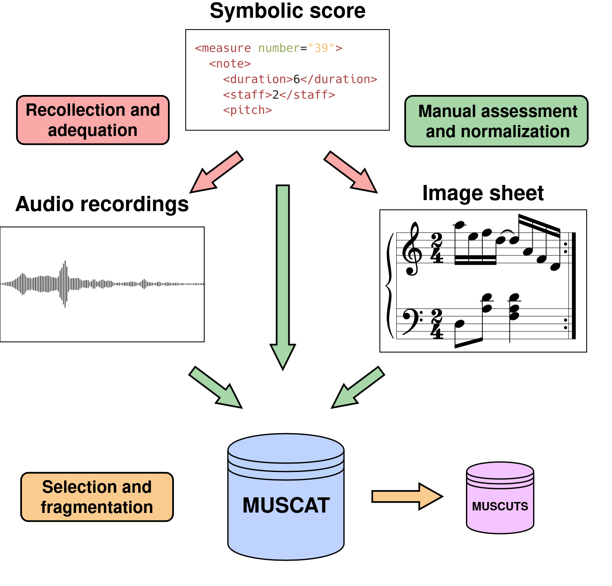

<p align='center'>
  <a href='https://sites.google.com/view/multiscore-project'></a>
</p>

<h1 align='center'>MUSCAT: a Multimodal mUSic Collection for Automatic Transcription of real recordings and image scores</h1>

<h4 align='center'>Full text available <a href='[https://ieeexplore.ieee.org/document/10447162](https://openreview.net/forum?id=B3CsOcxXOa)' target='_blank'>here</a>.</h4>

<p align='center'>
  
  
  
  
</p>

<p align='center'>
  <a href='#about'>About</a> •
  <a href='#how-to-use'>How To Use</a> •
  <a href='#citations'>Citations</a> •
  <a href='#acknowledgments'>Acknowledgments</a> •
  <a href='#license'>License</a>
</p>

## About

This repository is a modification of the _Alfaro-Contreras et al._ work: ["A Transformer Approach For Polyphonic Audio-To-Score Transcription"](https://github.com/mariaalfaroc/a2s-transformer). It pretends to serve as an initial baseline to the real music audio dataset _MUSCUTS_.

This dataset is a subset of the _MUSCAT_ dataset. Each sample is an approximately 30-second cut from a longer song. The dataset can be downloaded and more information can be found at the following [link](https://grfia.dlsi.ua.es/muscat/).

<br>

<p align="center">
  
</p>

## How To Use

The basic requirements are specified in the [`Dockerfile`](Dockerfile) and [`requirements.txt`](requirements.txt) as docker has been used. However, it is not mandatory, as any other virtual environment can be created.

The experiments were carried out with an initial training phase, like the script [`train_muscat`](scripts/train_muscat.sh); and a final testing phase providing the previous best weights as the script [`test_muscat`](scripts/train_muscat.sh).

## Citations


```
@inproceedings{
  galan-cuenca2024muscat,
  title={{MUSCAT}: a Multimodal m{US}ic Collection for Automatic Transcription of real recordings and image scores},
  author={Alejandro Galan-Cuenca and Jose J. Valero-Mas and Juan C. Martinez-Sevilla and Antonio Hidalgo-Centeno and Antonio Pertusa and Jorge Calvo-Zaragoza},
  booktitle={ACM Multimedia 2024},
  year={2024},
  url={https://openreview.net/forum?id=B3CsOcxXOa}
}
```

## Acknowledgments

This work is part of the I+D+i PID2020-118447RA-I00 ([MultiScore](https://sites.google.com/view/multiscore-project)) project, funded by MCIN/AEI/10.13039/501100011033. 

## License

This work is under a [MIT](LICENSE) license.
